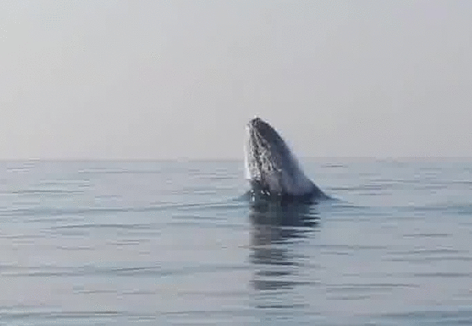

# Detecting Humpback Whale

Tensorflow object detection.
<br/>
<br/>
Run the program by typing following command in the terminal from models folder: 
<br/>
```
protoc object_detection/protos/*.proto --python_out=.
export PYTHONPATH=$PYTHONPATH:`pwd`:`pwd`/slim
python object_detection/train.py --logtostderr --pipeline_config_path=Path_to_tensorflow_object_detection/models/data/ssd_mobilenet_v1_pets.config --train_dir=Path_to_tensorflow_object_detection/models/train
python object_detection/eval.py --logtostderr --pipeline_config_path=Path_to_tensorflow_object_detection/models/data/ssd_mobilenet_v1_pets.config --checkpoint_dir=Path_to_tensorflow_object_detection/models/train --eval_dir=Path_to_tensorflow_object_detection/models/eval
tensorboard --logdir=Path_to_tensorflow_object_detection/model
```
<br/>
<br/>
Detection:
<br/>


