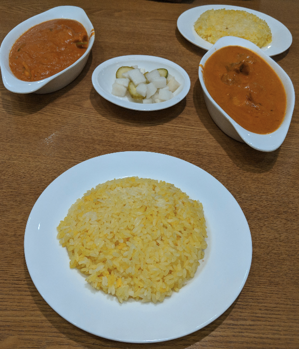

# KMeans
Implementation of kmeans on OpenCV and Sklearn.
<br/>
<br/>
Run the program by typing following command in the terminal: 
<br/>
```
python kmeans.py
python sk_kmeans.py
```
<br/>
<br/>
Original Image:
<br/>

<br/>
Segmented image by OpenCV implementation:
<br/>

<br/>
Colorband  0f the segmented image of the Sklearn implementation:
<br/>

