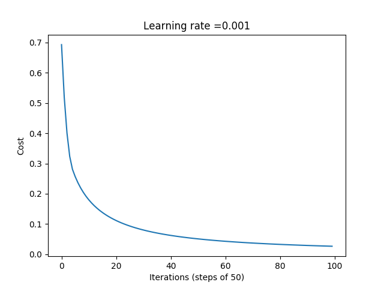

# Logistic Regresssion
Implementation of logistic regression on a single node nn. The model is trained on cat images and predicts if a given image is  a cat image or not. The accuracy is about 60-65%.
 
 
Following graph shows the plot of loss function against the iterations of step 50:
 
 

